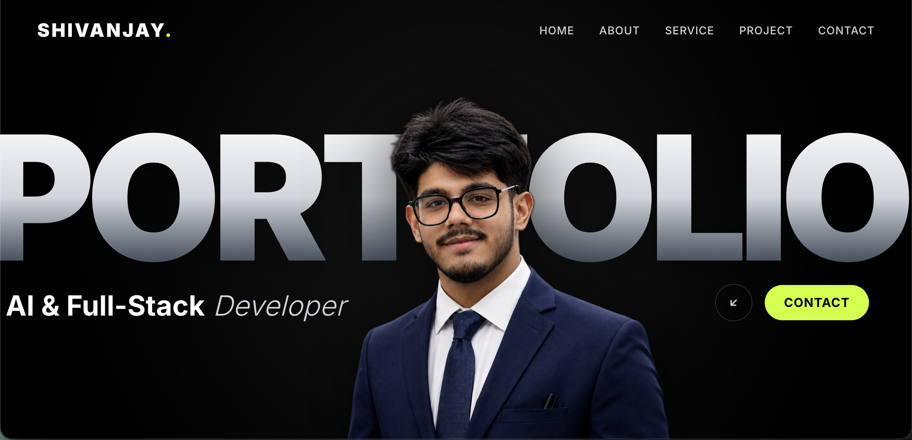

# ⚡ Shivanjay P. Bajpai — Portfolio Website

An interactive, high-performance, full-stack & AI engineering portfolio website matching a 1:1 modern design language with GSAP animations, AI background-removed portrait assets, interactive accordion services, and an Electric Neon Lime (`#ccff00`) visual identity.



---

## 🌟 Key Features

- **GSAP Scramble & Entrance Animation (`Hero.jsx`)**: 
  - Dynamic letter scramble animation swapping `"SHIVANJAY"` into `"PORTFOLIO"`.
  - Transparent AI-cutout portrait overlaying the central background text.
  - Smooth entrance sequence for subtitles and action CTAs.

- **GSAP Word-by-Word Scroll Reveal & Skills Marquee (`About.jsx`)**:
  - Word-by-word highlight scrub animation as you scroll through Shivanjay's intro text.
  - Framed vivid color portrait (`222.jpg`) in a glassmorphic card container.
  - 4-row continuous infinite skills marquee displaying frontend, backend, AI/ML, and DevOps skills.

- **Interactive Accordion Services (`Services.jsx`)**:
  - `WHAT I CAN DO` section with 6 interactive accordions (`01` to `06`).
  - Highlights with Electric Neon Lime (`#ccff00`) and crisp typography on hover and click.

- **Alternating Selected Work Cards (`Project.jsx`)**:
  - Showcase for Shivanjay's real-world engineering systems:
    1. **FITZEN Sports Vision Platform** (Computer Vision & Physics Anti-Tamper Platform)
    2. **Term Sheet Parser & Explainer** (LLM, OCR & RAG Document Intelligence)
    3. **Nashik Skills Live Intelligence** (AI Skill Intelligence & Matching Engine)
    4. **TEDx Event Licensing Platform** (2x Licensee & Executive Operations)

- **Video Background Contact & Graphic Footer (`Contact.jsx` & `Footer.jsx`)**:
  - Ambient video background (`contact_bg.mp4`) with glassmorphic contact form.
  - Screen-spanning `SHIVANJAY` brand graphic in the footer.

---

## 🛠️ Tech Stack

- **Frontend Core**: React 19, Vite 6, JavaScript (ES6+)
- **Styling**: Tailwind CSS v4, Glassmorphism, CSS Animations
- **Motion & Interactive Libraries**: GSAP 3 (ScrollTrigger), Framer Motion, Lucide Icons
- **Asset Processing**: AI Background Removal (`rembg`, PyTorch / ONNX U2-Net)

---

## 🚀 Quick Start & Local Setup

### Prerequisites
- Node.js (v18.0.0 or higher)
- npm (v9.0.0 or higher)

### Installation Steps

1. **Clone the repository**:
   ```bash
   git clone https://github.com/shivanjayb/Portfolio-Website.git
   cd Portfolio-Website
   ```

2. **Install dependencies**:
   ```bash
   npm install
   ```

3. **Launch local development server**:
   ```bash
   npm run dev
   ```
   Open `http://localhost:5173` in your browser.

4. **Build for production**:
   ```bash
   npm run build
   ```

---

## 📂 Project Structure

```text
Portfolio-Website/
├── public/
│   └── assets/photos/          # Public photo assets & transparent cutouts
├── src/
│   ├── assets/                 # Video, graphic, and section images
│   │   ├── Footer/
│   │   ├── about_section/
│   │   ├── contact_assets/
│   │   └── hero_assets/
│   ├── components/
│   │   ├── About.jsx           # Intro & scrolling skills marquee
│   │   ├── ComingSoon.jsx      # Fallback interactive modal
│   │   ├── Contact.jsx         # Video background contact section
│   │   ├── Footer.jsx          # Screen-wide brand footer
│   │   ├── Hero.jsx            # GSAP letter scramble & portrait hero
│   │   ├── Navbar.jsx          # Fixed header with mobile drawer
│   │   ├── Project.jsx         # Alternating project showcase cards
│   │   └── Services.jsx        # Interactive accordion services
│   ├── App.jsx                 # Master application layout
│   ├── index.css               # Global Tailwind CSS tokens & marquee keyframes
│   └── main.jsx                # React DOM entrypoint
├── package.json
└── vite.config.js
```

---

## 👤 Author & Contact

**Shivanjay Prakash Bajpai**
- **Role**: AI & Full-Stack Engineer | 2x TEDx Licensee & Primary Organizer
- **Email**: [shivanjayprakashbajpai@gmail.com](mailto:shivanjayprakashbajpai@gmail.com)
- **LinkedIn**: [linkedin.com/in/shivanjay-bajpai](https://linkedin.com/in/shivanjay-bajpai)
- **GitHub**: [github.com/shivanjayb](https://github.com/shivanjayb)

---

## 📄 License

This project is licensed under the MIT License - see the [LICENSE](LICENSE) file for details.
